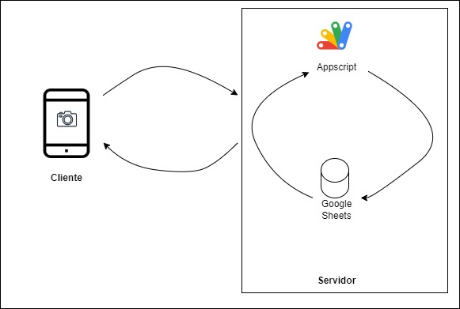
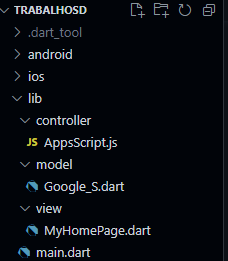

# Flutter_SD
Projeto final da matéria de Sistemas Distribuidos.
Consiste em um aplicativo de presença, em que o celular vai ler um código de barras da identificação do aluno e sua presença será verificada. Além da verificação da presença é possível adicionar um novo aluno pelo aplicativo. As presenças são salvas em uma planilha do Google, Google Sheets, em que é possível ver a matrícula do aluno e os dias em que ele esteve presente.

## Membros do grupo:
- Daniel Messias Santos **(202110168)**
- Luiz Filipe Bartelega Penha **(202111082)**
- Vitor Pires Zini **(202110169)**

## Tecnologias utilizadas:
- Flutter
- Javascript
- Apps Script
- Google Sheets

## Arquitetura de Sistema
  Arquitetura de Centralizada Cliente Servidor. Segundo Andrew S. Tanenbaum, a arquitetura Clitenter-Servidor é caracterizada por um servidor que é um processo que implementa um serviço específico e um cliente que é um processo que realiza as requisições dos serviços de um servidor e espera pela resposta do servidor.
  
  Cliente lê o código de barras.  
  API recebe a requisição e realiza as modificações no Google Sheets.  
  
  

## Arquitetura de Software
  Em nosso sistema foi utilizado a arquitetura de software MVC (Model, View, Controller). O Model representa a camada de dados e a regras de negócios do aplicativo. A View é responsável pela apresentação dos dados ao usuário e pela coleta de informações de entrada. O Controller recebe eventos da View, processa esses eventos e realiza as operações necessárias no Model.

  

  ## Tutorial
  - Após a instalação de tudo que é necessário para ter o Flutter em sua máquina e verificação para ver se está tudo certo utilizando o comando flutter doctor, vamos iniciar o nosso tutorial.
    
  ***1. Iniciando um projeto Flutter.***  
    Para iniciar um novo projeto vá para o diretório de deseja iniciar o projeto e abra o terminal. Com o terminal aberto digite o comando flutter create para iniciar um novo projeto.

  ```sh
  flutter create tutorial
  ```

  Utilize o comando cd tutorial para entrar no diretório do tutorial e em seguida utilize o comando flutter run para iniciar o projeto em um navegador de internet.
  ```sh
  cd tutorial

  flutter run
  ```


    
  ***2. Apague o projeto de exemplo.***  
  Você pode utilizar este projeto para inicializá-lo e testar para ver se está tudo funcionando corretamente. No entanto vamos apagá-lo para fazer o nosso.  
  Para isso deixa o arquivo main.dart apenas com a função void main().

  ```sh
  import 'package:flutter/material.dart';

  void main() {
    runApp(MeuAplicativo());
  }
  ```
  
  
***3. Setup do projeto***  
Vamos realizar o setup do nosso projeto, algumas modificações que iremos fazer no projeto não serão visíveis agora, no entanto, serão importantes para determinar algumas características do nosso projeto. Vamos definir um título para o projeto, desativar o banner de debug para que o projeto fique mais bonito e escolher um tema para o nosso projeto. Além disso, vamos chamar a nossa página principal que será feita posteriormente.

```sh
import 'package:flutter/material.dart';
import 'package:tutorial/view/home_page.dart';

void main() {
  runApp(MeuAplicativo());
}

class MeuAplicativo extends StatelessWidget {
  MeuAplicativo({super.key});

  @override
  Widget build(BuildContext context) {
    return MaterialApp(
      title: "Brasileirao",
      debugShowCheckedModeBanner: false,
      theme: ThemeData(
        primarySwatch: Colors.green,
        visualDensity: VisualDensity.adaptivePlatformDensity
      ),
      home: HomePage(),
    );
  }
}
```

 ***4. Criando a tela inicial***  
 Crie um novo arquivo chamado home_page.dart em uma pasta chamada view dentro da lib. Nesta pasta iremos colocar nossas telas que vamos criar. Neste primeiro momento vamos criar uma tela apenas para demonstrar a facilidade de utilização do Flutter para adicionar informações em uma nova view. 
```sh
  import 'package:flutter/material.dart';
  
  class HomePage extends StatelessWidget {
    const HomePage({super.key});
  
    @override
    Widget build(BuildContext context) {
      return Scaffold(
        body: Center(
          child: Text("Olá ALUNOS", style: TextStyle(
            fontSize: 30,
          ),), 
        ),
      );
    }
  }
  ```

  ***5. Dando vida ao aplicativo***  
  Nesse momento, já que aprendemos o básico sobre o flutter. É hora de começar a criar componentes que compoem um aplicativo de verdade. Para esse tutorial, iremos criar uma pequena lista de times do futebol brasileiro, para mostrar algumas possibilidades do flutter, como uma lista, uma AppBar e alguns recursos como pegar imagens da internet. Vamos começar criando um modelo para o Time. Crie uma nova pasta chamada Model, dentro de lib, que irá conter nossos modelos de componentes. Dentro de Models, crie um modelo para times:
  ```sh
  class Time {
    String nome;
    String brasao;
    int pontos;

    Time ({required this.nome, required this.brasao, required this.pontos});
  }
  ```

  ***6. Criando um controlador de times***  
  Uma vez que nosso modelo Time foi criado, é útil criar um controlador para realizar a construção dos times de nossa tabela, para aumentar a organização do projeto. Porém, como é um tutorial rápido, vamos manter o arquivo dentro de lib. O ideal para projetos é criar uma pasta apenas para controllers. Para esse passo, crie um arquivo home_controller em lib e garanta que ele possua uma lista de times que será inicializada em sua criação:
  ```sh
  import 'package:tutorial/models/time.dart';

  class HomeController {

    late List<Time> tabela;

    HomeController() {
      tabela = [
        Time(
          nome: 'Flamengo',
          brasao: 'https://upload.wikimedia.org/wikipedia/commons/thumb/2/2e/Flamengo_braz_logo.svg/1200px-Flamengo_braz_logo.svg.png',
          pontos: 71,
        ),
        Time(
          nome: 'Cruzeiro',
          brasao: 'https://upload.wikimedia.org/wikipedia/commons/thumb/9/90/Cruzeiro_Esporte_Clube_%28logo%29.svg/1200px-Cruzeiro_Esporte_Clube_%28logo%29.svg.png',
          pontos: 100,
        )
      ];
    }
  }
  ```
  ***7. Adicionando os componentes básicos e nossos modelos na Página Principal***  
  Para finalizar, vamos construir a página principal. Nosso modelo de time está pronto, assim como nosso controlador que será responsável por inicializar a nossa tabela adequadamente. Nessa etapa, crie componentes básicos como AppBar e um body. É importante que no corpo do aplicativo seja criada uma Lista com características de sua escolha, mas que contenham os nossos modelos de time. Para isso, siga o exemplo do código abaixo:
  ```sh
  import 'package:flutter/material.dart';
  import 'package:tutorial/home_controller.dart';

  class HomePage extends StatelessWidget {
    HomePage({super.key});
    var controller = HomeController();

    @override
    Widget build(BuildContext context) {
      return Scaffold(
        appBar: AppBar(
          title: Text('Brasileirao'),
          centerTitle: true,
        ),
        body: ListView.separated(
          itemCount: controller.tabela.length,
          itemBuilder: (BuildContext context, int i){
            final tabela = controller.tabela;
            // O Item da tabela vai ser construído a partir do ListTile, que é uma estrutura 
            return ListTile(
              leading: Image.network(tabela[i].brasao),
              title: Text(tabela[i].nome),
              trailing: Text(tabela[i].pontos.toString()),
            );
          }, 
          separatorBuilder: (_, __) => Divider(),
          padding: EdgeInsets.all(16),
        ),
      );
    }
  }
  ```
